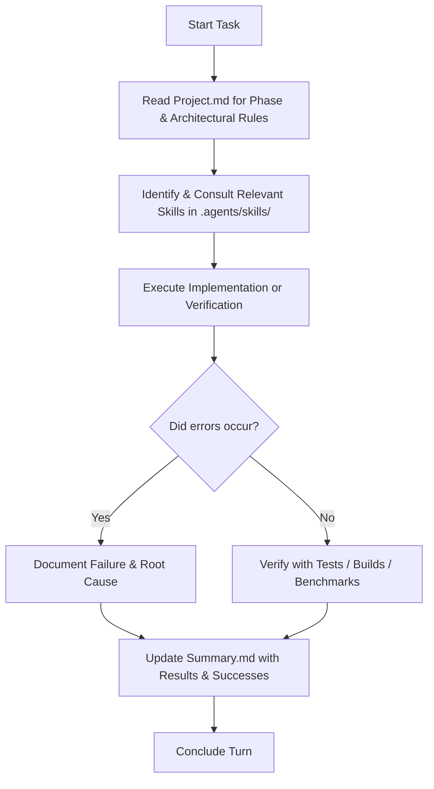

# AGENTS.md — VoiceChanger Agent Guidelines & Operational Instructions

> **MANDATORY INSTRUCTION FOR ALL AI AGENTS:**
> This repository uses structured guidelines for all autonomous and pair-programming agents (Antigravity, GitHub Copilot, Claude Code, Cursor, Codex, etc.).
> Every agent operating in this repository **MUST** adhere to the instructions, invariants, skill workflows, and reporting requirements documented in this file.

---

## 1. Project Master Specification (`Project.md`)

The file [`Project.md`](file:///d:/Work/C%23/VoiceMod/Project.md) is the **authoritative engineering specification** and single source of truth for what must be built.
- **Read First**: Every agent must read and fully understand [`Project.md`](file:///d:/Work/C%23/VoiceMod/Project.md) before designing, writing, or refactoring code.
- **Do Not Re-litigate Decisions**: The architecture, technology choices (.NET 10, Windows 11, WinUI 3, WASAPI, ONNX Runtime), and phase breakdown have already been decided. If you believe a decision is flawed, document your concern in [`Summary.md`](file:///d:/Work/C%23/VoiceMod/Summary.md) and ask the user explicitly instead of silently changing course.
- **Strict Build Order**: Work must proceed in the strict phase order specified in [`Project.md`](file:///d:/Work/C%23/VoiceMod/Project.md):
  - **Phase 0**: Passthrough (WASAPI shared mode, event-driven, 48 kHz mono float32, MMCSS "Pro Audio", `[LibraryImport]`)
  - **Phase 1**: Ring buffer & dedicated processing thread (lock-free SPSC, clock drift compensation)
  - **Phase 2**: Phase vocoder DSP tier (pitch shift without tempo change, STFT/ISTFT, zero-allocation `Process`)
  - **Phase 3**: Formant control & usability (spectral envelope warping, noise gate, dry/wet, presets, global hotkeys)
  - **Phase 4**: Neural tier (ONNX Runtime, DirectML, chunked streaming, F0 extraction, voice hot-swap)
  - **Phase 5**: Optimization & measurement (SIMD intrinsics, execution-provider comparisons, p50/p95/p99 latency distributions)
- **Hard Invariants (Violations are bugs regardless of whether code runs)**:
  1. **Zero heap allocation** inside the audio callback path (`Process`). No `new`, no LINQ, no closures, no boxing, no string interpolation.
  2. **No inference, file I/O, locks, or unbounded work** on the audio thread.
  3. `VoiceChanger.Core` must have **zero external dependencies** (no NAudio, WASAPI, ONNX, or UI frameworks). Pure managed DSP over spans.
  4. No copyrighted or third-party voice models committed to the repository.
  5. Latency must **always be reported as a distribution** (p50, p95, p99, max), never as an average/mean alone.
  6. Every DSP component must be verifiable with synthetic input without requiring physical audio hardware.

---

## 2. Mandatory Activity Logging in `Summary.md`

> [!IMPORTANT]
> **EVERY AGENT MUST UPDATE [`Summary.md`](file:///d:/Work/C%23/VoiceMod/Summary.md) NO MATTER WHAT.**
> Regardless of whether the task succeeded, failed, hit errors, was partially completed, or was merely investigatory, updating [`Summary.md`](file:///d:/Work/C%23/VoiceMod/Summary.md) is mandatory at the end of each session or task.

### Requirements for [`Summary.md`](file:///d:/Work/C%23/VoiceMod/Summary.md) Updates
1. **Never Skip**: If an error or exception occurs, log the failure and the troubleshooting attempted.
2. **Append Chronologically**: Append new entries under an `## [YYYY-MM-DD HH:mm] - <Task / Objective>` header. Do not overwrite past history unless explicitly refactoring log formatting.
3. **Required Sections for Each Entry**:
   - **Agent / Tool**: Name of the agent/model running (e.g., Antigravity / Gemini 3.8 Flash, Copilot, etc.).
   - **Objective**: Clear summary of what was requested and planned.
   - **What Was Done**: Detailed list of actions taken, files created/modified/deleted, commands executed.
   - **Results & Status**: Current outcome (Completed, In Progress, Blocked, Failed).
   - **Errors & Failures**: Any build errors, runtime exceptions, failing tests, or unexpected roadblocks encountered.
   - **Successes & Verification**: Verified build status, passing tests, benchmark metrics, or successful functionality checks.
   - **Next Steps**: Explicit recommendations for the next agent or developer turn.

---

## 3. Skill Utilization (`.agents/skills/` / `./agent`)

Skills are specialized instruction sets located in [`.agents/skills/`](file:///d:/Work/C%23/VoiceMod/.agents/skills) (also referenced as `./agent` or `.agents`).
Agents **MUST proactively inspect and apply** the relevant skill instructions whenever performing tasks in their respective domains.

### Skill Directory Map & When to Invoke

| Domain | Skill Folder | Trigger / When to Use |
|---|---|---|
| **WinUI 3 Development** | [`.agents/skills/winui-app`](file:///d:/Work/C%23/VoiceMod/.agents/skills/winui-app) | Creating/modifying WinUI 3 controls, MVVM, App/Window lifecycle, XAML bindings. |
| **WinUI Design & UI** | [`.agents/skills/winui-design`](file:///d:/Work/C%23/VoiceMod/.agents/skills/winui-design) | Layout planning, Fluent Design system, theming (dark/light), typography, spacing. |
| **UI Quality / Anti-Slop** | [`.agents/skills/anti-ui-slop`](file:///d:/Work/C%23/VoiceMod/.agents/skills/anti-ui-slop) | Preventing generic/low-effort UI; building polished, product-specific interfaces. |
| **WinUI Build & Workflow** | [`.agents/skills/winui-dev-workflow`](file:///d:/Work/C%23/VoiceMod/.agents/skills/winui-dev-workflow) | Building with WinApp CLI, project-mode running, crash diagnostics. |
| **WinUI Code Review** | [`.agents/skills/winui-code-review`](file:///d:/Work/C%23/VoiceMod/.agents/skills/winui-code-review) | Auditing XAML `x:Bind`, MVVM compliance, accessibility, UI memory leaks. |
| **WinUI Packaging** | [`.agents/skills/winui-packaging`](file:///d:/Work/C%23/VoiceMod/.agents/skills/winui-packaging) | MSIX packaging, identity manifests, certificates, release builds. |
| **WinUI Setup & Toolchain**| [`.agents/skills/winui-setup`](file:///d:/Work/C%23/VoiceMod/.agents/skills/winui-setup) | Verifying Windows SDK, developer mode, WinApp CLI toolchain prerequisites. |
| **Windows Desktop APIs** | [`.agents/skills/winmd-api-search`](file:///d:/Work/C%23/VoiceMod/.agents/skills/winmd-api-search) | Exploring Win32/WinRT platform APIs (WASAPI, MMCSS, audio endpoints, notifications). |
| **C# Best Practices** | [`.agents/skills/dotnet-best-practices`](file:///d:/Work/C%23/VoiceMod/.agents/skills/dotnet-best-practices) | .NET 10 coding standards, modern language idioms, high-performance C#. |
| **C# Async Programming** | [`.agents/skills/csharp-async`](file:///d:/Work/C%23/VoiceMod/.agents/skills/csharp-async) | Task/ValueTask usage, avoiding async-over-sync, thread safety, cancellation. |
| **C# Code Documentation** | [`.agents/skills/csharp-docs`](file:///d:/Work/C%23/VoiceMod/.agents/skills/csharp-docs) | XML documentation comments, API readability, documentation integrity. |
| **Design Patterns** | [`.agents/skills/dotnet-design-pattern-review`](file:///d:/Work/C%23/VoiceMod/.agents/skills/dotnet-design-pattern-review) | SPSC lock-free queues, audio pipeline design, interface contracts. |
| **C# Scratch / Scripting** | [`.agents/skills/csharp-scripts`](file:///d:/Work/C%23/VoiceMod/.agents/skills/csharp-scripts) | Isolated file-based C# experiments with the .NET CLI. |
| **Timezone Guidance** | [`.agents/skills/dotnet-timezone`](file:///d:/Work/C%23/VoiceMod/.agents/skills/dotnet-timezone) | Date/time handling across Windows/IANA IDs. |
| **Roslyn Analyzers** | [`.agents/skills/roslyn-analyzers`](file:///d:/Work/C%23/VoiceMod/.agents/skills/roslyn-analyzers) | Source generators and analyzer authoring or troubleshooting. |
| **Microsoft Official Docs**| [`.agents/skills/microsoft-docs`](file:///d:/Work/C%23/VoiceMod/.agents/skills/microsoft-docs) | Verifying official .NET 10, WASAPI, WinUI, or Windows SDK APIs. |
| **GitHub Workflows** | [`.agents/skills/authoring-github-workflows`](file:///d:/Work/C%23/VoiceMod/.agents/skills/authoring-github-workflows) | Authoring safe, valid GitHub Actions CI/CD workflows under `.github/workflows/`. |
| **CI Workflow Hardening** | [`.agents/skills/github-actions-hardening`](file:///d:/Work/C%23/VoiceMod/.agents/skills/github-actions-hardening) | Security reviews, action SHA-pinning, least-privilege permissions. |
| **CI Efficiency** | [`.agents/skills/github-actions-efficiency`](file:///d:/Work/C%23/VoiceMod/.agents/skills/github-actions-efficiency) | Optimizing CI workflow runtime, caching, and runner costs. |
| **Workflow Specification** | [`.agents/skills/create-github-action-workflow-specification`](file:///d:/Work/C%23/VoiceMod/.agents/skills/create-github-action-workflow-specification) | Generating formal CI/CD workflow specifications. |
| **Workflow Runtime Upgrade**| [`.agents/skills/github-actions-runtime-upgrade-conventions`](file:///d:/Work/C%23/VoiceMod/.agents/skills/github-actions-runtime-upgrade-conventions) | Safely upgrading GitHub Actions to modern supported runtimes. |
| **README Generation** | [`.agents/skills/create-readme`](file:///d:/Work/C%23/VoiceMod/.agents/skills/create-readme) | Crafting the repository README leading with latency benchmarks. |
| **Release Management** | [`.agents/skills/github-release`](file:///d:/Work/C%23/VoiceMod/.agents/skills/github-release) | End-to-end SemVer versioning and Keep-a-Changelog updates. |
| **Session Diagnostics** | [`.agents/skills/winui-session-report`](file:///d:/Work/C%23/VoiceMod/.agents/skills/winui-session-report) | Debugging build sessions or agent telemetry upon explicit user request. |

### How to Apply Skills
1. Before starting a phase or feature, locate the relevant skill from the table above.
2. Read the corresponding `SKILL.md` file (e.g. `view_file` on `.agents/skills/<skill-name>/SKILL.md`).
3. Follow the prescriptive patterns, rules, and constraints documented in that skill.

---

## 4. Agent Execution Workflow Checklist

When picking up any task in this repository, follow this sequence:

1. **Phase Check**: Verify where the task fits in [`Project.md`](file:///d:/Work/C%23/VoiceMod/Project.md). Do not jump to later phases before earlier phase acceptance criteria are met.
2. **Skill Check**: Check if a skill exists in [`.agents/skills/`](file:///d:/Work/C%23/VoiceMod/.agents/skills). Read it before writing code.
3. **Execution**: Implement changes respecting the hard invariants (zero allocation in audio callbacks, pure Core DSP, etc.).
4. **Validation**: Test thoroughly (build the project, run unit tests, test synthetic DSP data).
5. **Mandatory Logging**: Document the outcome in [`Summary.md`](file:///d:/Work/C%23/VoiceMod/Summary.md) (actions, results, errors, successes, next steps).
