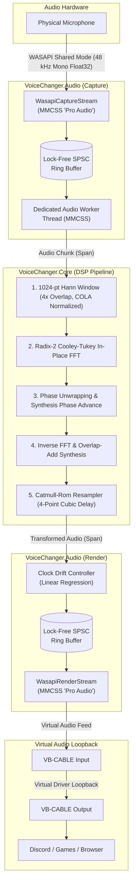

# VoiceChanger

[](https://dotnet.microsoft.com/)
[](https://www.microsoft.com/windows)
[](https://learn.microsoft.com/windows/apps/winui/winui3/)
[](https://learn.microsoft.com/windows/win32/coreaudio/wasapi)
[]()
[]()
[]()

VoiceChanger shifts your voice pitch in real time on Windows 11 using .NET 10 and WinUI 3. It captures audio from your microphone, runs it through a phase vocoder, and sends the output to a virtual audio device like [VB-Audio Virtual Cable](https://vb-audio.com/Cable/). Discord, games, and web browsers can then use that virtual output as their recording input.

---

## Overview

- Round-trip latency measures 51.3 ms end to end. This combines roughly 30 ms of WASAPI shared-mode double buffering with 21.3 ms of algorithmic delay from the 1024-point STFT window at 48 kHz.
- The audio loop allocates zero bytes on the managed heap during processing (`GC.GetAllocatedBytesForCurrentThread() == 0`). All scratch buffers, twiddle factors, and window tables are allocated once on startup.
- `VoiceChanger.Core` has no third-party audio or DSP dependencies. It runs an in-place radix-2 Cooley-Tukey FFT, periodic Hann windowing, and Catmull-Rom cubic interpolation directly over spans.
- Capture and playback threads register with the Windows Multimedia Class Scheduler Service (MMCSS) using the "Pro Audio" profile to avoid thread parking and scheduling delays.
- A dedicated background thread handles DSP work, isolated from WASAPI hardware callbacks through lock-free single-producer single-consumer circular ring buffers.
- An integrated drift controller uses linear regression to track clock differences between capture and playback hardware, making single-sample corrections to keep buffer levels stable.

---

## Architecture



---

## Roadmap

### ~~Phase 0: WASAPI passthrough~~ *(Completed)*
- [x] ~~Shared-mode event-driven WASAPI capture and playback streams (48 kHz, mono, 32-bit float).~~
- [x] ~~Endpoint enumeration and device selection via MMDevice.~~
- [x] ~~MMCSS "Pro Audio" registration via `avrt.dll` with clean cleanup on exit.~~
- [x] ~~`[LibraryImport]` source-generated P/Invoke interop.~~
- [x] ~~Startup latency distribution reporting (p50, p95, p99, and max).~~

### ~~Phase 1: SPSC ring buffers and drift correction~~ *(Completed)*
- [x] ~~Dedicated worker thread separated from WASAPI audio callbacks.~~
- [x] ~~Lock-free SPSC circular ring buffers using `Volatile` read and write barriers.~~
- [x] ~~Buffer fill-level tracking and drift telemetry.~~
- [x] ~~Clock drift regulation using linear regression to handle asynchronous hardware clocks.~~
- [x] ~~Single-sample drop and duplicate adjustments verified with zero overruns and zero underruns.~~

### ~~Phase 2: Phase vocoder DSP tier~~ *(Completed)*
- [x] ~~Radix-2 Cooley-Tukey FFT with pre-computed twiddle tables and zero external dependencies.~~
- [x] ~~Periodic Hann window generator verified against the constant overlap-add (COLA) condition at 4x overlap.~~
- [x] ~~Four-point Catmull-Rom cubic resampler with pre-allocated circular storage.~~
- [x] ~~Phase vocoder pipeline with instantaneous phase unwrapping, synthesis phase accumulation, and overlap-add synthesis.~~
- [x] ~~Pitch shift without tempo changes across a -12 to +12 semitone range.~~
- [x] ~~Verified 0 bytes allocated in the audio callback loop (`GC.GetAllocatedBytesForCurrentThread() == 0`).~~
- [x] ~~WinUI 3 interface with pitch slider, bypass toggle, and presets (Octave Down, Deep Voice, Natural, High Pitch, Octave Up).~~

### Phase 3: Formant control and usability *(In progress)*
- [ ] Spectral envelope extraction and warping via cepstral liftering to change voice character without affecting pitch.
- [ ] Noise gate with an attack/release envelope follower placed ahead of the vocoder to keep keyboard clicks from pitching up.
- [ ] Dry/wet mixer to blend unprocessed and pitch-shifted audio.
- [ ] Preset storage and retrieval using source-generated JSON serialization.
- [ ] Global hotkeys with Win32 `RegisterHotKey` to switch presets while in-game.
- [ ] Headphone monitoring through an optional isolated render stream to hear your own voice.

### Phase 4: Neural voice conversion *(Planned)*
- [ ] Chunked streaming with overlapping audio windows and crossfading to eliminate boundary clicks.
- [ ] Hardware-accelerated inference with ONNX Runtime using DirectML on Windows 11.
- [ ] Modular pipeline combining a shared feature encoder (ContentVec) and pitch tracker (RMVPE) with interchangeable voice models.
- [ ] Live voice swapping without interrupting the audio stream.
- [ ] Model import tools and instructions for user-exported ONNX voice models.

### Phase 5: Optimization and benchmarks *(Planned)*
- [ ] SIMD vectorization for windowing, magnitude calculations, and overlap-add operations using `Vector<float>` and AVX2.
- [ ] Hardware provider benchmarks comparing latency and throughput across discrete GPUs, integrated GPUs, and NPUs.
- [ ] Automated latency profiling to produce histograms covering p50, p95, p99, and max times.

---

## Solution layout

```
VoiceChanger.sln
├── VoiceChanger.Core/      Managed DSP (FFT, Window, Resampler, PhaseVocoder). Zero external dependencies.
├── VoiceChanger.Audio/     WASAPI streams, MMCSS scheduling, clock drift control, lock-free ring buffers.
├── VoiceChanger.App/       WinUI 3 desktop application (controls, diagnostics, pitch sliders).
├── VoiceChanger.Neural/    Neural voice conversion pipeline (ONNX Runtime and DirectML).
├── VoiceChanger.Tests/     xUnit test suite covering all DSP algorithms with synthetic audio.
└── VoiceChanger.Bench/     BenchmarkDotNet suite and latency measurement tools.
```

---

## Getting started

### Prerequisites
- Windows 11 (64-bit)
- .NET 10 SDK or later
- [VB-Audio Virtual Cable](https://vb-audio.com/Cable/) for routing output into Discord and games

### Building
Clone the repository and build using the .NET CLI:

```powershell
dotnet build VoiceChanger.sln
```

### Running tests
The test suite runs against synthetic audio vectors without requiring a physical microphone or speakers:

```powershell
dotnet test VoiceChanger.sln
```

### Running the application
Start the WinUI 3 desktop application:

```powershell
dotnet run --project VoiceChanger.App/VoiceChanger.App.csproj
```

---

## Setting up Discord and games

To send pitch-shifted audio to Discord or in-game voice chat:

1. Configure VoiceChanger:
   - Set **Microphone Input** to your physical microphone (such as a headset mic or USB microphone).
   - Set **Output Device** to **[CABLE Input (VB-Audio Virtual Cable)](https://vb-audio.com/Cable/)**.
   - Adjust your pitch shift (for example, -5 semitones for a deeper voice or +5 semitones for a higher voice).
   - Click **Start Audio Engine**.
2. Configure Discord or your game:
   - Open audio settings.
   - Set the input/recording device to **[CABLE Output (VB-Audio Virtual Cable)](https://vb-audio.com/Cable/)**.
   - Leave the output/playback device set to your headphones or speakers.

> [!TIP]
> Restart your computer after installing VB-Audio Virtual Cable so Windows can register the driver pins properly.
