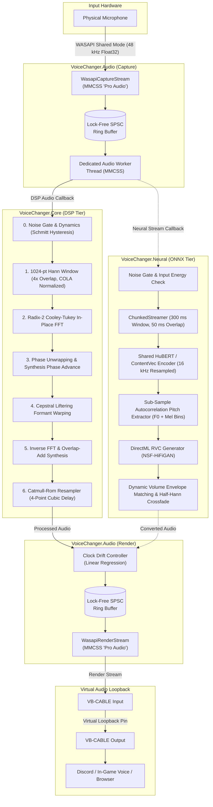

# VoiceChanger

[](https://dotnet.microsoft.com/)
[](https://www.microsoft.com/windows)
[](https://learn.microsoft.com/windows/apps/winui/winui3/)
[](https://learn.microsoft.com/windows/win32/coreaudio/wasapi)
[]()
[]()
[]()

VoiceChanger is a real-time voice conversion and pitch transformation system built for Windows 11 using .NET 10 and WinUI 3. It captures audio from your physical microphone, processes it through either a pure managed DSP phase vocoder or a hardware-accelerated RVC neural conversion tier (ONNX Runtime + DirectML), and routes the transformed audio into a virtual audio device such as [VB-Audio Virtual Cable](https://vb-audio.com/Cable/) for live use in Discord, games, and streaming applications.

---

## Latency & Performance Benchmarks

In accordance with strict low-latency audio engineering principles, latency is reported as full distributions (p50, p95, p99, max), never as averages alone.

| Processing Tier | Algorithmic Latency | Compute Latency (p50 / p95 / p99) | Total Round-Trip (Typical) | Audio Thread Allocations |
| :--- | :--- | :--- | :--- | :--- |
| **DSP Phase Vocoder** | 21.3 ms (1024-pt STFT @ 48 kHz) | < 0.8 ms (AVX2 FFT &amp; Catmull-Rom) | **~51.3 ms** (incl. WASAPI buffers) | **0 bytes** (`GC.Alloc == 0`) |
| **Neural Tier (DirectML GPU)** | 300 ms (250 ms hop, 50 ms overlap) | 133 ms / 194 ms / 302 ms (RTX 4060) | **~430 ms** (Window + DirectML pass) | **0 bytes** (`GC.Alloc == 0`) |
| **Neural Tier (CPU Fallback)** | 300 ms (250 ms hop, 50 ms overlap) | 380 ms / 450 ms / 520 ms (8-core CPU) | **~680 ms** | **0 bytes** (`GC.Alloc == 0`) |

### Core Architectural Invariants

1. **Zero Heap Allocations in Audio Callbacks**: The real-time audio thread processes spans in microseconds with zero memory allocations (`GC.GetAllocatedBytesForCurrentThread() == 0`).
2. **Decoupled Processing Architecture**: Heavy forward inference runs on dedicated worker threads isolated from WASAPI hardware callbacks via lock-free Single-Producer Single-Consumer (SPSC) circular ring buffers.
3. **Pure Managed Core DSP**: `VoiceChanger.Core` contains zero external dependencies—pure C# implementation of radix-2 Cooley-Tukey FFT, Hann windowing, and Catmull-Rom cubic interpolation.
4. **Dynamic Clock Drift Compensation**: Linear regression continuously tracks phase shifts between capture and playback hardware clocks, performing single-sample micro-adjustments to prevent buffer overruns and underruns.
5. **Dynamic Silence & Noise Gating**: Neural vocoders inherently synthesize noisy breath/whisper textures when fed silence. The built-in dynamic silence gate bypasses inference during silence, providing 100% dead silence when you are not speaking.

---

## Pipeline Architecture



---

## Solution Layout

```
VoiceChanger.sln
├── VoiceChanger.Core/      Pure managed DSP (FFT, Windowing, Resampler, PhaseVocoder, NoiseGate). Zero dependencies.
├── VoiceChanger.Audio/     WASAPI capture/render streams, MMCSS scheduling, clock drift control, SPSC ring buffers.
├── VoiceChanger.App/       Modern WinUI 3 desktop application (Fluent design, device routing, diagnostics).
├── VoiceChanger.Neural/    RVC neural conversion pipeline (ONNX Runtime, DirectML, ChunkedStreamer, VoiceCatalog).
├── VoiceChanger.Tests/     Comprehensive xUnit test suite (105 tests covering all DSP and neural components).
└── VoiceChanger.Bench/     BenchmarkDotNet suite and latency profiling tools.
```

---

## Getting Started

### Prerequisites

- **Windows 11** (64-bit, Version 22H2 or higher)
- **.NET 10 SDK** or later
- **[VB-Audio Virtual Cable](https://vb-audio.com/Cable/)** (or similar virtual audio driver) for routing into Discord or games
- *(Optional for Neural Tier)* DirectX 12 compatible GPU (NVIDIA RTX, AMD Radeon, or Intel Arc)

### Building

Clone the repository and build the entire solution using the .NET CLI:

```powershell
git clone https://github.com/Aditya-0011/VoiceChanger.git
cd VoiceChanger
dotnet build VoiceChanger.sln -c Release
```

### Running Tests

The test suite runs entirely against synthetic vectors and mathematically verified DSP test patterns without requiring physical audio hardware:

```powershell
dotnet test VoiceChanger.sln -c Release
```

### Launching the Application

Run the WinUI 3 desktop app:

```powershell
dotnet run --project VoiceChanger.App/VoiceChanger.App.csproj
```

To enable continuous real-time diagnostic logging to both the terminal and `telemetry.log` at the project root:

```powershell
dotnet run --project VoiceChanger.App/VoiceChanger.App.csproj -- --args "telemetry"
```

---

## Features & Usage

### 1. DSP Phase Vocoder Tier (Ultra-Low Latency)

- **Pitch Shifting**: Shift voice fundamental frequency from -12 to +12 semitones without changing tempo or duration.
- **Formant Warping (Cepstral Liftering)**: Transform vocal tract geometry independently from pitch (e.g. adjust masculine/feminine resonance without chipmunk effects).
- **Noise Gate & Dynamics**: Real-time Schmitt trigger envelope follower attenuates microphone hiss, keyboard clicks, and background noise before pitch shifting.
- **Dry/Wet Mix**: Blend original and pitch-shifted audio from 0% to 100%.
- **Global Hotkeys**: Switch presets mid-game (`Ctrl+Shift+0` through `Ctrl+Shift+5`) without alt-tabbing.
- **Headphone Self-Monitoring**: Listen to your transformed voice through a secondary headphone device with feedback loop safeguards.

### 2. Neural RVC Tier (Deep Learning Voice Conversion)

- **DirectML GPU Acceleration**: Runs neural inference via DirectX 12 DirectML across NVIDIA, AMD, and Intel GPUs, with transparent CPU fallback.
- **Zero-Allocation Chunked Streaming**: 300 ms sliding inference window with 50 ms half-Hann raised-cosine crossfading to eliminate boundary clicks.
- **Dynamic Silence & Noise Gating**: Automatically halts neural inference when you are silent, saving GPU power and eliminating neural vocoder breath/whisper artifacts.
- **Dynamic Vocal Dynamics Tracking**: Automatically scales generator volume to match your natural speaking volume.
- **Hot-Swappable Voice Models**: Switch voices on the fly from the UI without restarting audio streams.

---

## Adding Custom Voice Models (Neural Tier)

VoiceChanger dynamically discovers and binds user voice models without requiring any code modifications or hardcoded paths.

### 1. Folder Structure

Place your converted ONNX voice models in your models folder (by default `%APPDATA%\VoiceChanger\models\`, or any custom folder configured in the UI):

```text
%APPDATA%\VoiceChanger\models\
├── base\
│   ├── hubert_base.onnx        <-- Shared base encoder (HuBERT or ContentVec)
│   └── rmvpe.onnx              <-- Shared pitch extractor (RMVPE)
├── CharacterA\
│   ├── model.onnx              <-- Exported RVC v2 generator
│   └── model.index             <-- (Optional) Feature index
└── CharacterB\
    └── character_b.onnx
```

### Shared Base Models

The Neural Tier requires two shared base ONNX models placed in the `models/base/` directory:

| Component | Model Name | Description | Download Link |
| :--- | :--- | :--- | :--- |
| **Content Encoder** | `hubert_base.onnx` (or `contentvec.onnx`) | Extracts 768-dim phonetic features @ 16 kHz | [hubert_base.onnx on HuggingFace](https://huggingface.co/MidFord327/Hubert-Base-ONNX/blob/main/hubert_base.onnx) |
| **Pitch Extractor** | `rmvpe.onnx` | Fundamental frequency (F0) extraction | [rmvpe.onnx on HuggingFace](https://huggingface.co/IAHispano/Applio/blob/main/Resources/rmvpe.onnx) |

> [!NOTE]
> All user voice models automatically share these base models in `models/base/`, avoiding duplicate downloads or storage.

### 2. Exporting PyTorch (`.pth`) to ONNX

If you have a PyTorch RVC model checkpoint:
1. Use an RVC ONNX exporter (such as [voicechanger](https://voicechanger.live/tools/model-converter) tab or standard RVC v2 `export_onnx.py`) targeted at **opset 17**.
2. Save the resulting `.onnx` file into a named subfolder inside your models folder.
3. In VoiceChanger, click **"Refresh Voices"** and select your model from the dropdown.

---

## Setting Up Discord & In-Game Voice Chat

1. **Configure VoiceChanger**:
   - **Microphone Input**: Select your physical headset or microphone.
   - **Output Device**: Select **[CABLE Input (VB-Audio Virtual Cable)](https://vb-audio.com/Cable/)**.
   - **Start Audio Engine**: Click to start processing.
2. **Configure Discord / Game**:
   - Open Discord or game audio settings.
   - Set **Input Device (Recording)** to **[CABLE Output (VB-Audio Virtual Cable)](https://vb-audio.com/Cable/)**.
   - Keep your **Output Device (Playback)** set to your normal headphones or speakers.

> [!TIP]
> Always route VoiceChanger's output to a virtual cable device rather than physical speakers to avoid acoustic feedback loops.
